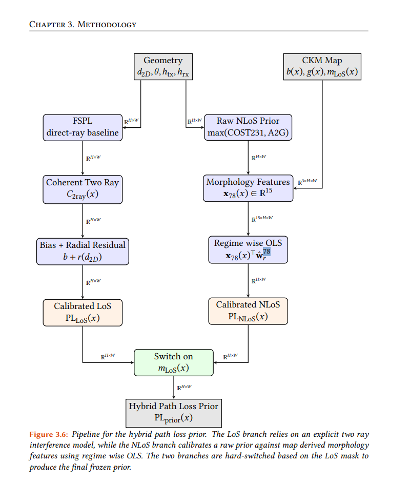
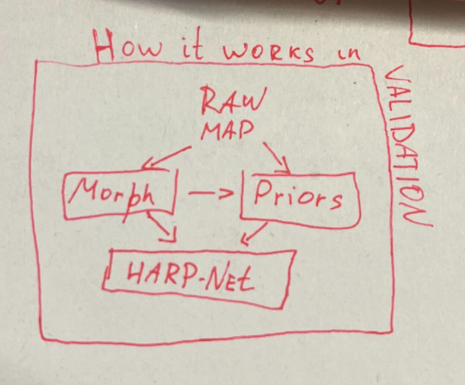
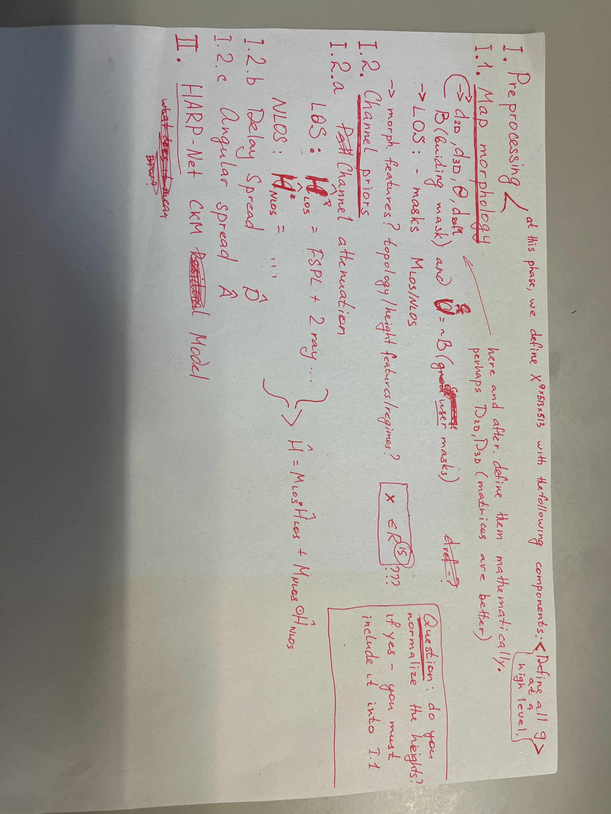

- The SOA table of the spreads it's not exactly the spreads , but Angles of Arrival mostly. Maybe say that.
- Check in the literature that Angular Spread prediction is nearly unique to us.
- This is important because the motivation for the Angular Spread Prediction is antenna type and beamforming.
- Put figure 3.6 on the beginning of the path loss channel sub chapter. And then in the following sub sub chapter in the following subsections. This way every sub section of nLoS and LoS part are well. Have the speech of the path loss prior at the end (third subsection), not in the nLoS , which is where it is now (basically the third subsection should be the global one we think).
- Change x78 to just x morphology nLoS or whatever, there is try 78 everywhere, we should normalize the name to where is somewhere else.  (the same for LoS, x morphology LoS). Basically remove from everywhere (except in try_78_xxx.json) the 78 and 79s everywhere. Also in the diagrams. (and in the spreads (x79 make it x morphology or a better name)). Remove 78 and 79 everywhere.
- Also figure 3.1, like make it more abstract. Just show how the model works , maybe simplify it further and show that 2 is connected with 4 for example and that is fed into harp-net. Make another 3.1 figure (make the current one 3.2) that is simpler and more high level. 
- Maybe mention somewhere (results) that the multilinear regression of the prior works pretty good, it's an empirical and tested approach. But deep learning still puts underlying structure that is not shown by the multilinear regression (figure 4.1 2 and third rows and 2 and 3 columns), like the actual difference at the border of structures that the deep learning puts there. Even if in the RMSE the results are not much better, it gives better structure, while it is not tested SSMI would probably improve much more than rmse with prior vs DL + prior.
- Going back to 3.1 and the rest of chapter 3, we say at the beginning of chapter 3: "At this stage we define XXX with the following components, map morphology and channels priors, for PL (nLoS and LoS), DS and AS. And then we have this structure of the chapter (this is done by the Professor): " Morphology first (city buildings, then distances then masks, also unify d3D and dLoS because it's the same. Also show mathematically how we calculate EVERYTHING, masks and distances, maybe better in matrix form if possible, also how in CKMGenerator are LoS and nLoS masks are ACTUALLY derived, explain in detail) (also define things well, height regimes at the beginning, page 60 is too late, and all unified). Then the priors in the order we said. One difference with the image we decided on now, is instead of 2 sub sub chapters for Path Loss make 3, one for LoS, one for nLoS and one global (at the end). Also in HARP-NET in chapter let's go from abstract high level to defined things.